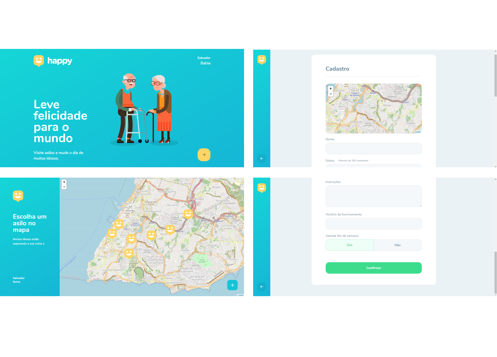
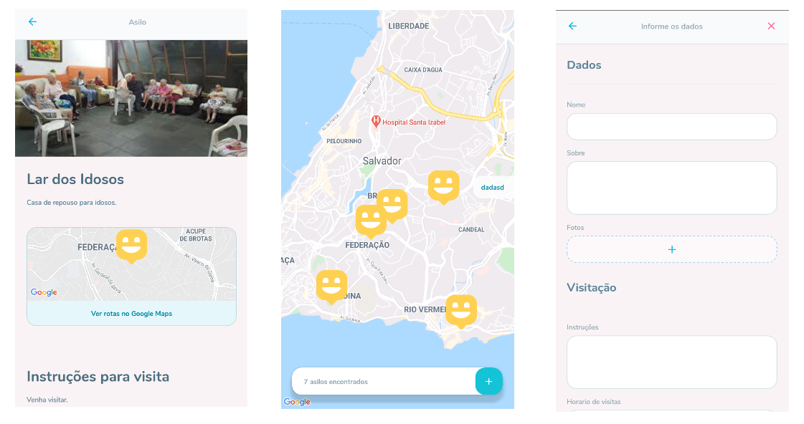

##Happy

Leve felicidade para o mundo, visite asilos e mude o dia de muitos idosos. Baseado no NLW#3

## Sobre

Essa aplicação permite a visualização de asilos no mapa e o cadastro de novos asilos.

## Layout

<h3> Frontend </h3>

<h1>

</h1>

<h3> Mobile</h3>

<h1>

</h1>

## Executando o Happy

### Pré-requisitos

- NodeJS
- Gerenciador de pacotes (Npm ou Yarn) 

<h2 Tecnologias </h2>

As ferramentas usadas no desenvolvimento do projeto.

#### Backend:
 - Javascript
 - NodeJS
 - Express
 - Express Async Errors
 - MongoDB
 - Multer
 - Cors

#### Web:
- Typescript
- ReactJS 
- React Router Dom
- React Icons
- Leaflet
- API do Open Street Map

#### Mobile:
- Typescript
- React Native
- Expo
